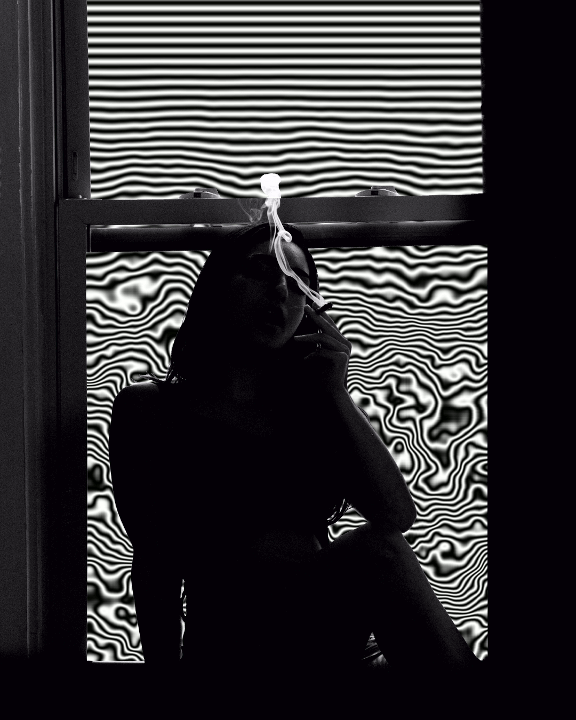
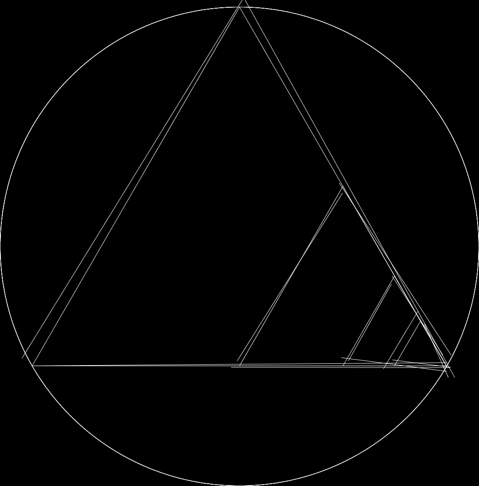

# creative-coding-showcase

Some examples of generative art I have created

**Generative Art:** Art created through the use of autonomous systems, such as natural language rules, algorithms, genetic sequences, machines, or procedural interventions

